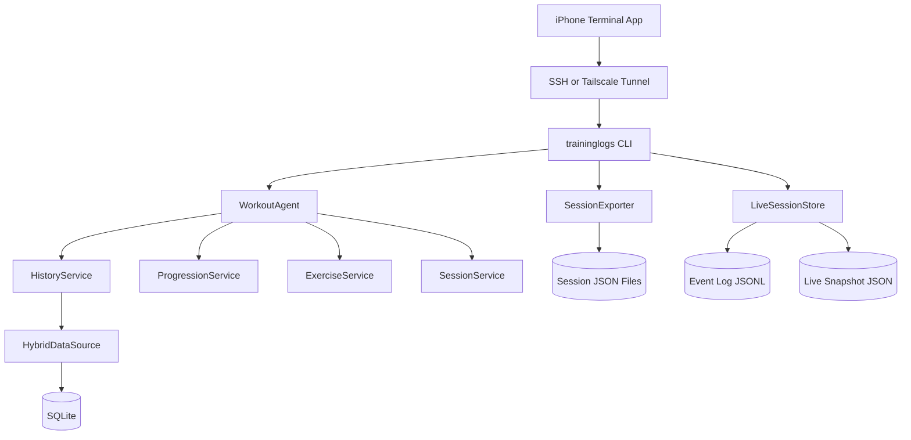
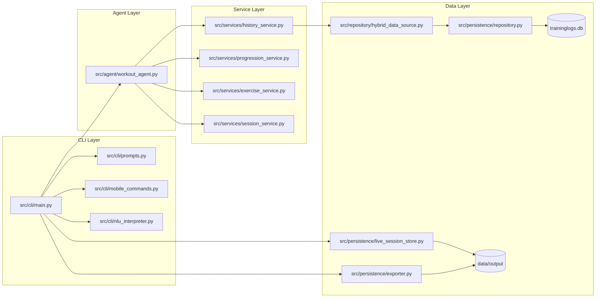
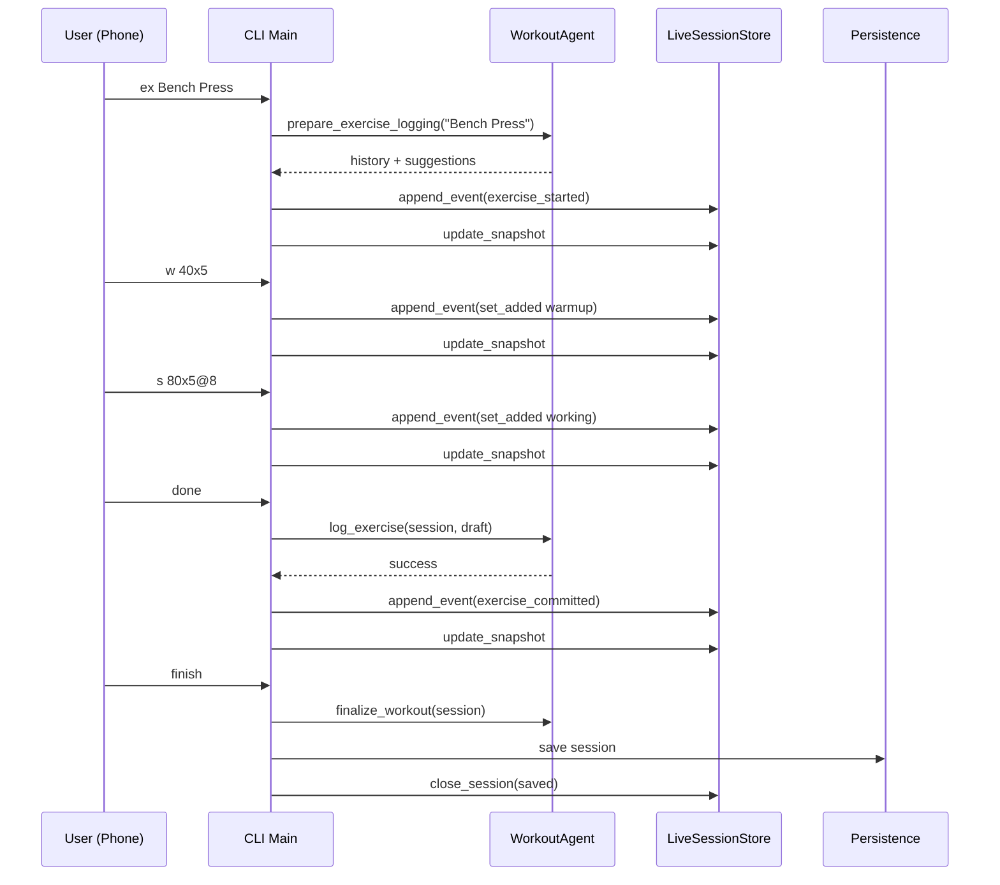
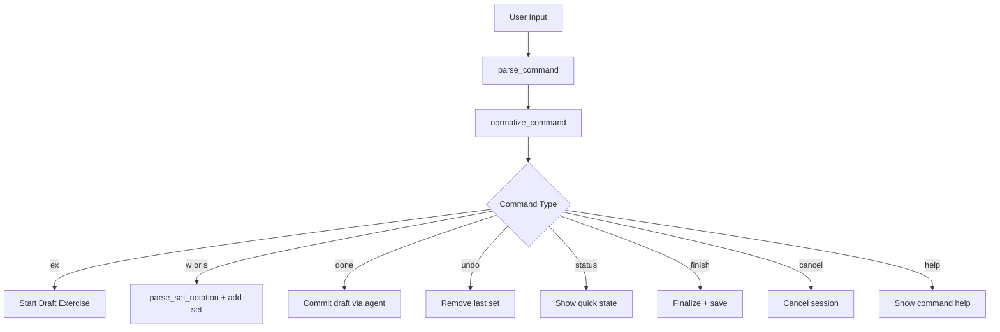
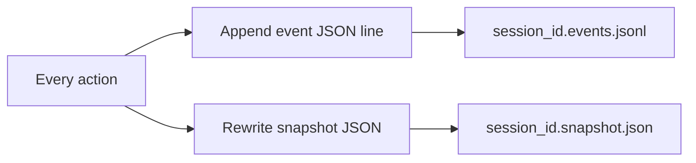
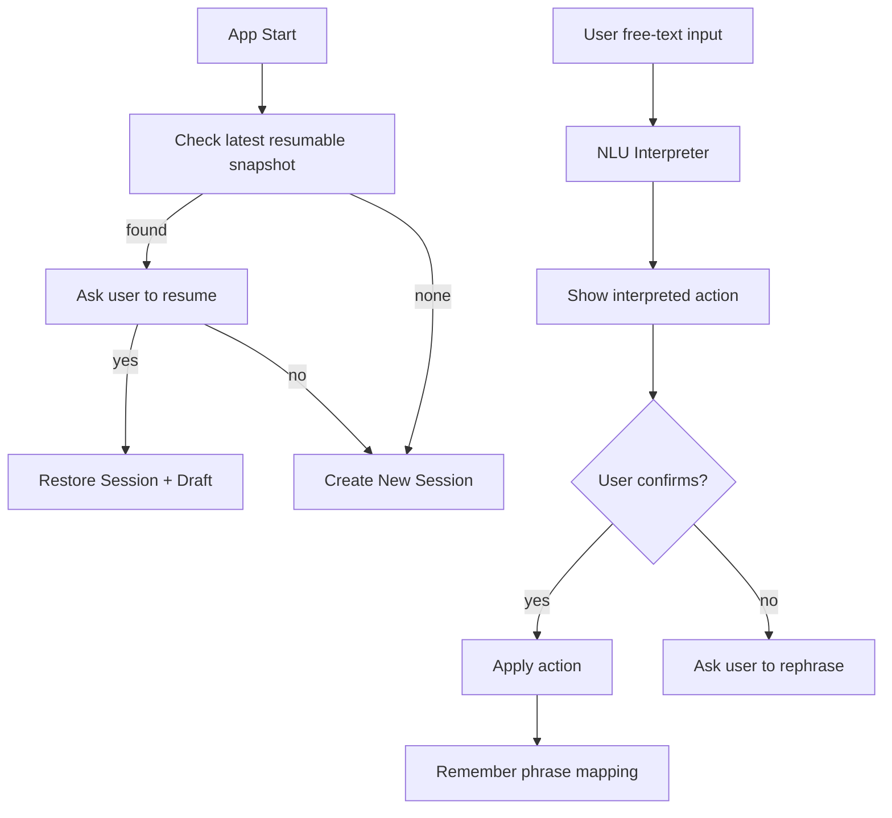

# Conversational CLI Workout Agent Architecture

This document describes the phone-friendly CLI POC in simple language.

## 1) System View

## 2) Runtime Components

## 3) Conversational Loop

## 4) Command Grammar

## 5) Autosave Model

The event log is append-only for audit.  
The snapshot is the latest recoverable state.

## 6) Resume + Learning

