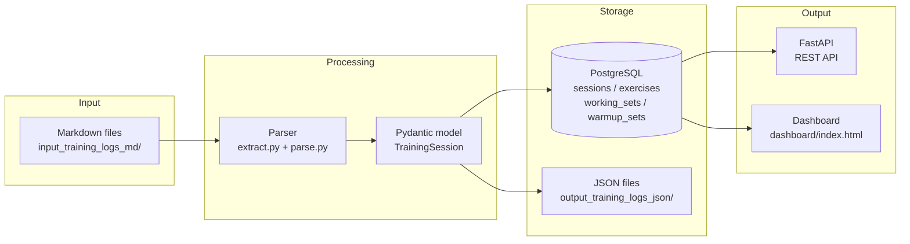
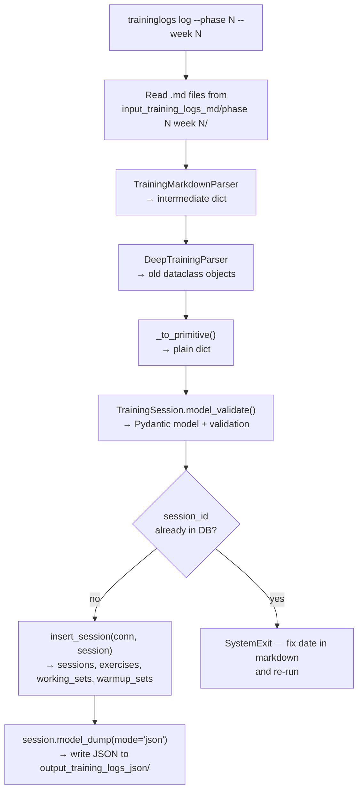
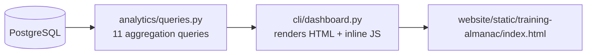

# Architecture

## 1. Overview

traininglogs is a pipeline for personal strength training data. Workouts are written as markdown files, parsed into structured Pydantic models, inserted into PostgreSQL, served via a FastAPI REST API, and visualised as a static HTML dashboard. There is no live AI processing — all parsing is rule-based today; an AI agent is planned for future capture (Track B).

---

## 2. Architecture



**Component responsibilities:**

| Component | File | Role |
|---|---|---|
| Parser | `parser/extract.py`, `parser/parse.py` | Converts raw markdown to old dataclass models (bridge, to be replaced by AI agent) |
| Processor | `processor/processor_v2.py` | Orchestrates parse → Pydantic → DB insert → JSON write |
| Pydantic models | `models/models_v2.py` | Canonical schema and validation; source of truth for all data shapes |
| DB layer | `db/db.py`, `db/schema.sql`, `db/insert_v2.py`, `db/fetch.py` | Schema creation, insert, and fetch — raw SQL via psycopg2 |
| FastAPI | `api/app.py` | REST API with API key auth, 3 endpoints |
| Analytics | `analytics/queries.py` | SQL queries for dashboard aggregations |
| CLI | `cli/log.py`, `cli/dashboard.py` | `traininglogs log`: full workflow; `dashboard.py`: renders Training Almanac HTML |

---

## 3. Data Flow

### Processing a training week



**Key rule:** DB insert happens before JSON write. A `session_id` collision (duplicate date in markdown) is an error, not a silent skip.

### Building the dashboard



---

## 4. Data Model

All models are Pydantic v2 (`models/models_v2.py`). `TrainingSession` is the root; everything is nested inside it.

### Model hierarchy

```
TrainingSession
├── session_id: str               (e.g. "2026-04-28_upper-strength")
├── date: str                     (YYYY-MM-DD)
├── program: str
├── program_author: str
├── program_length_weeks: int
├── phase: int
├── week: int                     (1 ≤ week ≤ program_length_weeks)
├── is_deload_week: bool
├── focus: str                    (e.g. "upper-strength", "lower-hypertrophy")
├── session_duration_minutes: int
├── user_id: str
├── user_name: str
├── data_model_version: str
├── data_model_type: str
└── exercises: List[Exercise]
    ├── number: int               (1-indexed, sequential — validated)
    ├── name: str
    ├── target_muscle_groups: Optional[List[str]]
    ├── rep_tempo: Optional[str]
    ├── notes: Optional[str]
    ├── warmup_notes: Optional[str]
    ├── form_cues: Optional[List[str]]
    ├── current_goal: Optional[Goal]
    │   ├── weight_kg: float
    │   ├── sets: int
    │   ├── rep_range: RepRange { min: int, max: int }
    │   └── rest_minutes: Optional[int]  (0–15)
    ├── warmup_sets: Optional[List[WarmupSet]]
    │   ├── number: int
    │   ├── weight_kg: float
    │   ├── rep_count: Optional[int]
    │   └── notes: Optional[str]
    └── working_sets: Optional[List[WorkingSet]]
        ├── number: int
        ├── weight_kg: float
        ├── rep_count: RepCount { full: int, partial: int = 0 }
        ├── rpe: Optional[float]          (1.0–10.0, whole or half steps)
        ├── rep_quality_assessment: Optional[RepQualityAssessment]
        │   └── enum: good | bad | perfect | learning
        ├── actual_rest_minutes: Optional[int]  (0–15)
        ├── notes: Optional[str]
        └── failure_technique: Optional[FailureTechnique]
            (discriminated union on technique_type)
            ├── MyoRepsTechnique
            │   └── details: MyoRepDetails { mini_sets: List[MyoRep] }
            │       └── MyoRep { number: int, rep_count: RepCount }
            ├── LLPTechnique
            │   └── details: LLPDetails { partial_rep_count: int }
            ├── StaticTechnique
            │   └── details: StaticDetails { hold_duration_seconds: int }
            └── DropSetTechnique
                └── details: DropSetDetails { drop_sets: List[DropSet] }
                    └── DropSet { number: int, weight_kg: float, rep_count: RepCount }
```

### Key validation rules

- `failure_technique` is only valid on sets where `rpe == 10`
- Exercise `number` fields must be sequential starting at 1
- `week` must be between 1 and `program_length_weeks`
- RPE must be a whole number or half step (e.g. 7, 7.5) between 1 and 10
- `rest_minutes` and `actual_rest_minutes` must be between 0 and 15
- All required string fields reject empty/whitespace values

---

## 5. Database Schema

Four tables. `sessions` is the root; all others cascade-delete when a session is deleted.

```sql
sessions
├── session_id           TEXT  PRIMARY KEY
├── date                 DATE  NOT NULL
├── program              TEXT
├── program_author       TEXT
├── program_length_weeks INT
├── phase                INT
├── week                 INT
├── is_deload_week       BOOLEAN
├── focus                TEXT
├── duration_minutes     INT
├── user_id              TEXT
└── user_name            TEXT

exercises
├── id                   SERIAL  PRIMARY KEY
├── session_id           TEXT    FK → sessions(session_id)  ON DELETE CASCADE
├── number               INT     NOT NULL
├── name                 TEXT    NOT NULL
├── notes                TEXT
├── warmup_notes         TEXT
├── form_cues            TEXT[]
├── goal_weight_kg       NUMERIC
├── goal_sets            INT
├── goal_rep_min         INT
├── goal_rep_max         INT
├── goal_rest_min        INT
├── target_muscle_groups TEXT[]
└── rep_tempo            TEXT

working_sets
├── id                   SERIAL  PRIMARY KEY
├── exercise_id          INT     FK → exercises(id)  ON DELETE CASCADE
├── number               INT     NOT NULL
├── weight_kg            NUMERIC
├── reps_full            INT
├── reps_partial         INT
├── rpe                  NUMERIC
├── rep_quality          TEXT
├── rest_minutes         NUMERIC
├── notes                TEXT
└── failure_technique    JSONB

warmup_sets
├── id                   SERIAL  PRIMARY KEY
├── exercise_id          INT     FK → exercises(id)  ON DELETE CASCADE
├── number               INT     NOT NULL
├── weight_kg            NUMERIC
├── rep_count            INT
└── notes                TEXT
```

`failure_technique` is stored as JSONB. Its shape matches the `FailureTechnique` discriminated union in the Pydantic model — `technique_type` is the discriminator key.

---

## 6. API Reference

Base URL: `http://localhost:8000`

All endpoints require the header `X-Api-Key: <your key>`. The API fails at startup if `API_KEY` is not set in the environment.

---

### `GET /sessions`

List sessions. All query parameters are optional and combinable.

**Query parameters:**

| Parameter | Type | Description |
|---|---|---|
| `phase` | int | Filter by phase number |
| `week` | int | Filter by week number |
| `from_date` | str (YYYY-MM-DD) | Sessions on or after this date |
| `to_date` | str (YYYY-MM-DD) | Sessions on or before this date |

**Response:** Array of session summaries, ordered by date descending.

```json
[
  {
    "session_id": "2026-04-28_upper-strength",
    "date": "2026-04-28",
    "program": "GZCLP",
    "phase": 3,
    "week": 11,
    "focus": "upper-strength",
    "duration_minutes": 75,
    "is_deload_week": false
  }
]
```

---

### `GET /sessions/{session_id}`

Full session detail including all exercises, working sets, and warmup sets.

**Path parameter:** `session_id` — exact match.

**Response:** Full session object. Returns `404` if not found.

```json
{
  "session_id": "2026-04-28_upper-strength",
  "date": "2026-04-28",
  "program": "GZCLP",
  "program_author": "...",
  "program_length_weeks": 16,
  "phase": 3,
  "week": 11,
  "is_deload_week": false,
  "focus": "upper-strength",
  "duration_minutes": 75,
  "user_id": "user_1",
  "user_name": "Apoorva Sharma",
  "exercises": [
    {
      "number": 1,
      "name": "Barbell Bench Press",
      "notes": null,
      "warmup_notes": null,
      "form_cues": ["brace the core"],
      "goal_weight_kg": 85.0,
      "goal_sets": 3,
      "goal_rep_min": 5,
      "goal_rep_max": 6,
      "goal_rest_min": 2,
      "target_muscle_groups": ["chest", "triceps"],
      "rep_tempo": null,
      "working_sets": [
        {
          "number": 1,
          "weight_kg": 82.5,
          "reps_full": 5,
          "reps_partial": 0,
          "rpe": 8.0,
          "rep_quality": "good",
          "rest_minutes": null,
          "notes": null,
          "failure_technique": null
        }
      ],
      "warmup_sets": [
        {
          "number": 1,
          "weight_kg": 40.0,
          "rep_count": 5,
          "notes": null
        }
      ]
    }
  ]
}
```

---

### `GET /exercises/{name}/history`

All working sets for a given exercise across all sessions, ordered by date and set number.

**Path parameter:** `name` — case-insensitive exact match against exercise name.

**Response:** Array of set records. Returns `404` if no history found.

```json
[
  {
    "date": "2026-01-10",
    "phase": 3,
    "week": 1,
    "session_id": "2026-01-10_upper-strength",
    "number": 1,
    "weight_kg": 80.0,
    "reps_full": 5,
    "reps_partial": 0,
    "rpe": 7.5,
    "rep_quality": "good",
    "failure_technique": null
  }
]
```

---

## 7. Dashboard

The dashboard is a single static HTML file built by `cli/dashboard.py` and written to `website/static/training-almanac/index.html`. It is rebuilt automatically as part of `traininglogs log`.

**Rebuild via the normal workflow:**

```bash
traininglogs log --phase <n> --week <n>           # rebuild only
traininglogs log --phase <n> --week <n> --publish  # rebuild + push to website
```

Requires `DATABASE_URL` in `.env` and Postgres running.

**Analytics queries run at build time** (from `analytics/queries.py`):

| Query | Purpose |
|---|---|
| `overview_stats` | Total tonnage, sessions, weeks trained, last session date |
| `weekly_tonnage_by_phase` | Weekly volume bar chart grouped by phase |
| `exercise_e1rm_trend` | Estimated 1RM over time per exercise (Epley formula) |
| `weekly_muscle_group_volume` | Weekly working sets per muscle group |
| `rpe_distribution` | Histogram of RPE values across all working sets |
| `fatigue_within_phase` | Average RPE by week within each phase |
| `deload_effect` | Pre/during/post deload volume and RPE comparison |
| `stimulus_fatigue_by_exercise` | Average RPE vs tonnage-per-set per exercise |
| `personal_records` | Heaviest set per exercise |
| `failure_technique_usage` | Count of each technique type used |
| `exercise_list` | All distinct exercise names (used to populate dropdown) |

The HTML file embeds all data as inline JSON and renders charts with Chart.js. No server is required to view it.
